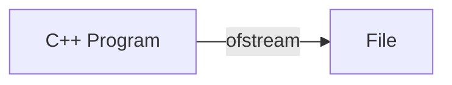

# File Input/Output

> Input/Output is usually stylized as I/O or IO.

The concept of:

- Sending information from inside our program to an outside system
- Receiving information from an outside system and using it inside our program

We can send and receive information from many sources:

- Operating system
- Network
- Files
- Databases
- etc.

## File IO

File IO is implemented with streams. Why might file IO be implemented with streams?

- **Reduced Memory Use** — Reading an entire file into memory is often unnecessary. Streams let us examine just one "chunk" at a time, saving memory.
- **Speed** — Reading an entire file at once could be very slow, especially if the file is massive. Streams let us control the amount we read, saving time.

### Implementation

Provided by `fstream` in the C++ Standard Library. The functionality is separated into two classes:

1. `ifstream` — Input File Stream
1. `ofstream` — Output File Stream

#### `ifstream`

`ifstream` is a **stream** for reading input from a file.

```
input file stream
i     f    stream   →  ifstream
```


#### `ofstream`

`ofstream` is a **stream** for writing output to a file.

```
output file stream
o      f    stream  →  ofstream
```



### Example

```cpp
#include <fstream> // include fstream
using namespace std;

int main() {
    // ifstream & ofstream are now available for use
    ifstream variable_name;
    ofstream another_variable_name;
}
```

## Quiz

> Which stream can work with the operating system IO?
>
> `cin` & `cout`

> Which streams can work with file IO?
>
> `ifstream` & `ofstream`

> Which manipulators can affect the `cin` & `cout` streams?
>
> - Make tables with `setw(n)`,`left`,`right`,`setfill(c)`
> - Format Decimals with `setprecision(n)`,`fixed`,`scientific`,`showpoint`
> - Affect the Buffer with `endl`,`flush`

> Which manipulators can affect the `ifstream` & `ofstream` streams?
>
> _The same ones!_
>
> This is a benefit of the stream concept. The same techniques can be shared among different streams, reusing your existing knowledge.

## Reading & Writing Files

### How to **Read** a Text File

1. Allocate an `ifstream`
1. Open the file with its name
1. Read the file with stream functions
1. Close the file

### How to **Write** a Text File

1. Allocate an `ofstream`
1. Open the file with its name
1. Write to the the file with stream functions
1. Close the file

### `ifstream` Interface

| Method                        | Use                                                                      |
| ----------------------------- | ------------------------------------------------------------------------ |
| `.open(s)`                    | Open a file by file name (string)                                        |
| `.is_open()`                  | Whether the `.open(s)` action was successful                             |
| `.fail()`                     | Whether the most recent "read" action was successful                     |
| `.close()`                    | Close the connection to the file                                         |
| `ifstream >> variable`        | Extract file contents into the variable, stopping at the next whitespace |
| `getline(ifstream, variable)` | Extract file contents into the variable, stopping at the next newline    |

[zyBook Table 10.3.1: Stream error state flags and functions to check error state](https://learn.zybooks.com/zybook/HARDINGCOMP1510McCownSpring2025/chapter/10/section/3?content_resource_id=108375069)

### Idiom to Read a File

Read pokemon.txt into a `vector<string>`

`pokemon.txt`

```txt
Bulbasaur
Charmander
Squirtle
```

`main.cpp`

```cpp
#include <string>
#include <fstream>

int main() {
    // Input Stream entity. It "streams" the contents of the file.
    ifstream pokemonFS;

    // Open the file by filename
    pokemonFS.open("pokemon.txt");

    // To hold each line, one at a time
    string line;

    // Read each line of the file
    while (pokemonFS >> line /* getline(pokemonFS, line) */) {
        // ...
    }

    // Close the file
    pokemonFS.close();
}
```

### Choosing the "Chunk"

```cpp
fileFS >> line        // reads until next whitespace
```

```cpp
getline(fileFS, line) // reads until next newline
```

### Analysis

#### How does this work?

- `ifstream` provides an interface to access the file system, and process the text file.

- `line` provides a "container" to store each piece of the file as a string, as it is "streamed".

- `while` loops until (implicit) call to `.fail()` returns true, either because there is nothing left to read or an error occurred.

#### Why does it work?

What type of expression does `while` expect?

```cpp
while(pokemonFS >> line) { /* ... */ }
```

`while` expects a boolean.

- `>>` and `getline()` both return a reference to the stream.
- `ifstream` can be converted into a `bool` implicitly by the compiler.
- The result of the `.fail()` method is automatically.
- Trying to read after end-of-file is reached causes `.fail()` to return true.
- Therefore, the `while` loop ends when a read is attempted after end-of-file is reached.

Other Resources:

- [Deep Dive into error checking an `ifstream`](https://gehrcke.de/2011/06/reading-files-in-c-using-ifstream-dealing-correctly-with-badbit-failbit-eofbit-and-perror/)

### Another Option

We can also call `.fail()` directly to stop reading at end-of-file, but we must do the checks in a certain order.

This approach is not recommended because it is easy to get the operations out of order by mistake.

```cpp
// We must read the first line before starting the loop
pokemonFS >> line;

// Check if read failed in the previous loop
while(!pokemonFS.fail()) {

    cout << line;

    // We must read another chunk only after using line
    pokemonFS >> line;
}
```

### Errors

There are several errors which can happen when reading from a file stream.

### Summary

| Problem                | Solution                            |
| ---------------------- | ----------------------------------- |
| Nonexistent File       | `.is_open()`                        |
| Improper Variable Type | Don't make mistakes ☹️              |
| Reading Past EOF       | Stop reading when `.fail() == true` |

### **Problem:** Opening a file which does not exist.

#### Fix

File with the provided name might not exist, or the code may be denied access. Check that the file is open with `.is_open()` before reading.

#### Example

```cpp
ifstream pokemonFS;
string line;

// Mistake in filename
string filename = "pokem0n.txt";
pokemonFS.open(filename);

// Evaluates to `false`!
while (pokemonFS >> line) {
    // ...
}

// Proceeds without reading any file contents...

```

Fixed by terminating the program if the file could not be opened.

```cpp
ifstream pokemonFS;
string line;

// Mistake in filename
string filename = "pokem0n.txt";
pokemonFS.open(filename);

// Terminate application, since we can't do anything useful without the file
if (!pokemonFS.is_open()) {
    cout << "Could not open file " + filename ". Does it exist?";
    return 1;
}

while (pokemonFS >> line) {
    // ...
}
```

### **Problem:** Assigning data to a variable which cannot hold the data.

#### Fix

Program correctly. ☹️ (Tests are the real answer.)

#### Example

```cpp
ifstream fin;
int num;

// ❌ getline() returns string, which cannot be assigned to num
while (getline(fin, num)) {
    //...
}
```

Fixed by storing into a variable with the right type.

```cpp
ifstream fin;
string line;

// ✅ getline() returns a string, which can be assigned to line
while (getline(fin, line)) {
    //...
}
```

### **Problem:** Trying to read when there is nothing left.

#### Fix

Stop reading at the end-of-file. Use an idiom which handles EOF and errors. See discussion above.

#### Example

`pokemon.txt`

```txt
Bulbasaur
Charmander
Squirtle
```

`main.cpp`

```cpp
ifstream pokemonFS;
string bulbasaur;
string charmander;
string squirtle;
string caterpie;

pokemonFS >> bulbasaur;
pokemonFS >> charmander;
pokemonFS >> squirtle;
pokemonFS >> caterpie; // ❌ No 4th chunk!
```

Fixed by looping until end-of-file using implicit conversion of stream to boolean.

```cpp
string line;
while(pokemonFS >> line) { /* ... */ }
```
